```{r setup}
#| include: false
# Alle Zahlen und Abbildungen werden beim Rendern neu erzeugt.
source("R/01_simulate_data.R", local = new.env())
source("R/02_compute_numbers.R", local = new.env())
source("R/03_figures.R", local = new.env())

get_val <- function(file, key) {
  d <- read.csv(file.path("output", file))
  d[[2]][d[[1]] == key]
}
params   <- read.csv("output/sim_params.csv")
beta0    <- get_val("sim_params.csv", "beta0")
beta1    <- get_val("sim_params.csv", "beta1")
n_total  <- get_val("lm_numbers.csv", "n_total")
pred_lo  <- get_val("lm_numbers.csv", "lm_pred_min_x")
pred_hi  <- get_val("lm_numbers.csv", "lm_pred_max_x")
x_lo     <- get_val("lm_numbers.csv", "x_min_obs")
x_hi     <- get_val("lm_numbers.csv", "x_max_obs")
n_out    <- get_val("lm_numbers.csv", "n_fitted_outside_01")
x_mid    <- get_val("true_curve.csv", "x_at_pi_50")
x_mid2   <- get_val("true_curve.csv", "x_at_pi_50_beta1_doubled")
tt       <- read.csv("output/transform_table.csv")
odds_80  <- tt$odds[tt$pi == 0.8]

f2 <- function(x) sub("^-", "\u2212", formatC(x, format = "f", digits = 2))
pct <- function(x) paste0(formatC(100 * x, format = "f", digits = 0), " %")
materials_url <- "https://gidonfrischkorn.github.io/lehrprobe-logistische-regression/"

# Zahlen für den Selbsttest (Folie 10), aus R/02_compute_numbers.R
kn         <- read.csv("output/klicker_numbers.csv")
pi_check   <- kn$value[kn$quantity == "pi_check"]
odds_check <- kn$value[kn$quantity == "odds_check"]
fmt_pi <- function(x) sub("^0", "", formatC(x, format = "f", digits = 2))

# KlickerUZH-Beitritt: ein QR aus dem Link in der YAML (klicker-join-url).
# Ohne Link zeigen die Folien einen sichtbaren Platzhalter statt eines QR.
klicker_join_url <- rmarkdown::metadata[["klicker-join-url"]]
klicker_qr_file  <- "figures/klicker_qr.png"
klicker_qr_uzh   <- "figures/klickeruzh_qr.png"   # offizieller QR aus KlickerUZH
has_url <- !is.null(klicker_join_url) && nzchar(klicker_join_url)
has_klicker <- has_url &&
  (file.exists(klicker_qr_uzh) || requireNamespace("qrcode", quietly = TRUE))
if (has_klicker && file.exists(klicker_qr_uzh)) {
  file.copy(klicker_qr_uzh, klicker_qr_file, overwrite = TRUE)
} else if (has_klicker) {
  png(klicker_qr_file, width = 600, height = 600, bg = "white")
  par(mar = c(0, 0, 0, 0)); plot(qrcode::qr_code(klicker_join_url, ecl = "M"))
  dev.off()
} else if (file.exists(klicker_qr_file)) {
  file.remove(klicker_qr_file)   # kein veralteter QR auf den Folien
}
join_box <- function(px, label = "KlickerUZH") {
  if (has_klicker) {
    cat(sprintf(paste0(
      '<div class="join-box"><span>%s</span></div>'),
      klicker_qr_file, px, px, klicker_join_url, label))
  } else {
    cat(sprintf('<div class="join-box join-missing">%s: Link fehlt (klicker-join-url in slides.qmd)</div>', label))
  }
}
```

## Wo stehen wir?

::: {.timeline}
::: {}
[Bisher]{.label}
Statistik I: Binomialverteilung, Odds im Bayes-Beispiel. Letzte Sitzung: lineare Regression als Modell, eine Normalverteilung, deren Mittelwert von $x$ (z. B. Anzahl Sitzungen) abhängt
:::
::: {.now .fragment fragment-index=2}
[Jetzt]{.label}
Was ändert sich, wenn die abhängige Variable nur 0 oder 1 sein kann?
:::
::: {.fragment fragment-index=1}
[Danach]{.label}
Koeffizienten als Odds Ratios interpretieren, Schätzung, `glm(family = binomial)` in R
:::
:::

<br>

::: {.fragment fragment-index=3}
**Laufendes Beispiel** (simulierte Daten): `r n_total` Patient:innen nach einer Psychotherapie.
Remission ja (1) oder nein (0), je nach Anzahl Therapiesitzungen (`r x_lo` bis `r x_hi`).
:::

::: {.notes}
EINORDNUNG (0:00–0:30), 3 Klicks. Wörtlich etwa:
«In der letzten Sitzung haben wir die lineare Regression als statistisches Modell
kennengelernt: eine Normalverteilung, deren Mittelwert von x abhängt.»
[Klick] Danach. «Nach diesem Abschnitt schauen wir uns an, wie man die Koeffizienten
als Odds Ratios interpretiert und das Modell in R schätzt.»
[Klick] Jetzt. «Und dazwischen: heute.» Frage vorlesen.
[Klick] Beispiel einführen: Klinische Frage, die sie kennen: Hängt es mit der Anzahl
Sitzungen zusammen, ob jemand remittiert? Was Remission heisst: nächste Folie.
:::

## Das Beispiel: Was heisst Remission? {.remission}

**Diagnose** (Beispiel Depression nach DSM-5): mindestens **5 von 9** Symptomen über zwei Wochen, darunter gedrückte Stimmung oder Interessenverlust. Die Kriterien sind **erfüllt oder nicht**.

:::: {.columns}
::: {.column width="50%"}
{.foto fig-alt="Schwarzweissfoto: eine Frau von hinten, den Kopf gesenkt."}

[●●●●[|]{.schwelle}●●○○○]{.symptome} 6 von 9 Symptomen: über der Schwelle

Kriterien weiter erfüllt: **keine Remission**, $Y = 0$
:::
::: {.column width="50%"}
::: {.fragment fragment-index=1}
{.foto fig-alt="Farbfoto: eine Frau von hinten, die mit erhobenen Armen in der Abendsonne durch ein Feld tanzt."}

[●●●○[|]{.schwelle}○○○○○]{.symptome} 3 von 9 Symptomen: unter der Schwelle

Kriterien nicht mehr erfüllt: **Remission**, $Y = 1$
:::
:::
::::

::: {.fragment .merke fragment-index=2}
Die Symptome gehen schrittweise zurück, die Diagnose kennt nur ja oder nein. Deshalb ist auch **Remission binär**.
:::

[Fotos: Pixabay «Free-photos», Jesse Uli (Unsplash); CC0, via Wikimedia Commons]{.bildnachweis}

::: {.notes}
BEISPIEL (neu, ca. 40 s), 2 Klicks. Start: Kriterium und linke Person.
«Remission heisst: Die Symptome sind so weit zurückgegangen, dass die Diagnosekriterien
nicht mehr erfüllt sind. Und eine Diagnose ist ein Ja/Nein-Urteil: Bei einer Depression
braucht es mindestens fünf von neun Symptomen über zwei Wochen.»
Links: «Nach der Therapie noch sechs Symptome: Diagnose bleibt, keine Remission, 0.»
[Klick] Rechts: «Nur noch drei Symptome: Kriterien nicht mehr erfüllt, Remission, 1.»
[Klick] Merke: «Die Symptome nehmen schrittweise ab, aber die Schwelle macht daraus
ja oder nein. Deshalb ist unsere abhängige Variable binär.»
Falls jemand fragt: In Therapiestudien wird Remission oft auch über einen Grenzwert auf
einem Fragebogen bestimmt; das ist dieselbe Logik, eine Schwelle macht aus einem
kontinuierlichen Wert ein Ja/Nein.
:::

## Ihre Intuition ist gefragt {.intuition}

:::: {.columns}
::: {.column width="62%"}
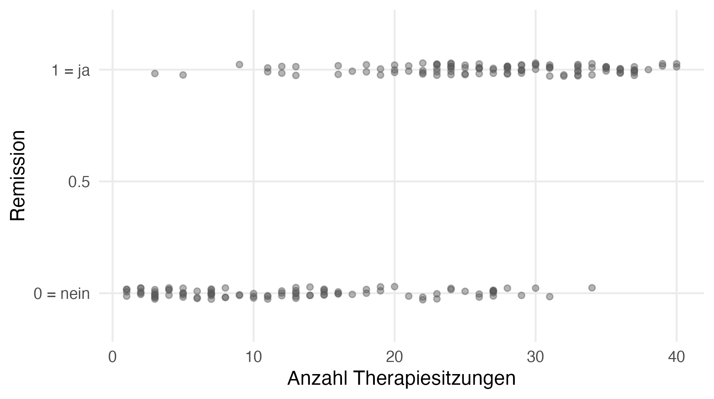{fig-alt="Streudiagramm: Remission (0 = nein, 1 = ja) gegen Anzahl Therapiesitzungen von 1 bis 40. Bei wenigen Sitzungen liegen fast alle Punkte bei 0, bei vielen Sitzungen fast alle bei 1."}
:::
::: {.column width="38%"}
::: {.klicker}
**KlickerUZH:** Was passiert, wenn wir eine lineare Regression mit einer binären abhängigen Variable rechnen?

A. Das ist kein Problem, die Regressionsgerade beschreibt die Daten akzeptabel.

B. Für manche Personen sagt die Gerade Werte unter 0 oder über 1 vorher. Das ist nicht ideal.

C. Eine solche Analyse kann man nicht rechnen, R bricht mit einer Fehlermeldung ab.
:::

```{r join-slide3}
#| results: asis
join_box(130)
```
:::
::::

::: {.notes}
KLICKER (0:30–1:35), keine Klicks: alle Optionen stehen von Anfang an. Block 1 in
KlickerUZH (Single Choice A/B/C, Countdown 35 s). Der QR stand schon auf der Titelfolie.
[Klicker] Block 1 öffnen (Cockpit auf dem Handy), dabei sagen: «Schätzen Sie, ohne zu
rechnen, 30 Sekunden. Wer noch nicht drin ist: QR rechts.» Dann, während sie tippen:
«Unter der Frage sehen Sie zwei Regler, Tempo und Schwierigkeit. Verschieben Sie die,
wann immer Sie wollen, ich schaue nachher drauf.» (Live Feedback, Option b.)
Block schliesst sich nach 35 s selbst; Balken auf dem Handy-Cockpit ablesen, NICHT
auflösen: «Interessant, Sie sind sich nicht einig. Schauen wir nach.»
Fallback ohne Netz / KlickerUZH: Handzeichen A/B/C (je Option kurz zählen lassen).
Erwartung: viele A oder C. C ist falsch: R rechnet lm() mit 0/1 klaglos.
:::

## Was passiert mit der Geraden? {.nostretch}

:::: {.columns}
::: {.column width="68%"}
::: {.r-stack .layers}
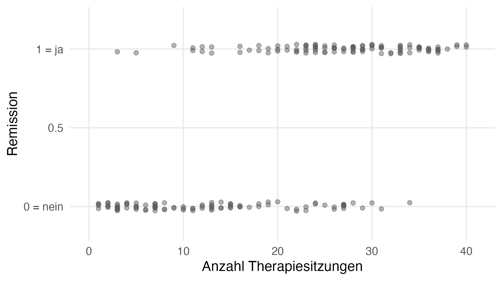{fig-alt="Streudiagramm: Remission (0 = nein, 1 = ja) gegen Anzahl Therapiesitzungen von 1 bis 40, dieselben Daten wie auf der Klicker-Folie."}

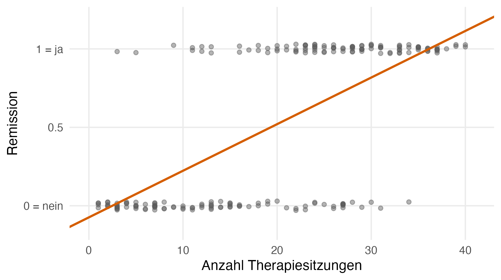{.fragment fragment-index=1 fig-alt="Dieselben Daten mit der Regressionsgeraden der linearen Regression. Die Gerade steigt von links unten nach rechts oben."}

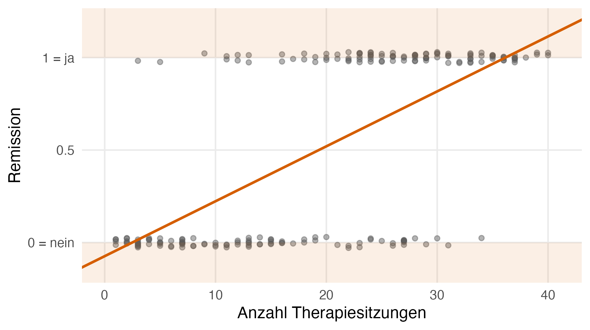{.fragment fragment-index=2 fig-alt="Dieselben Daten mit der Regressionsgeraden. Die Bereiche unter 0 und über 1 sind orange schattiert; die Gerade liegt links unter 0 und rechts über 1."}

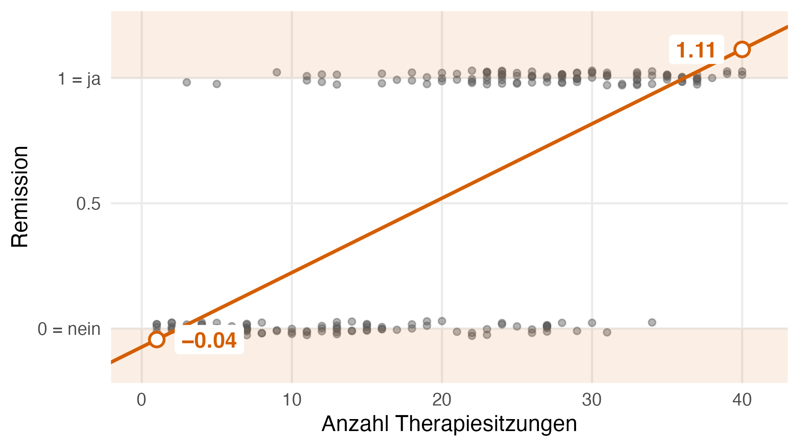{.fragment fragment-index=3 fig-alt="Wie zuvor, zusätzlich sind die Vorhersagen der Geraden bei 1 und bei 40 Sitzungen als Kreise markiert und beschriftet: `r f2(pred_lo)` und `r f2(pred_hi)`."}
:::
:::
::: {.column .lm-code width="32%"}
::: {.fragment fragment-index=1}
Die Gerade in R:

```{.r code-line-numbers="false"}
lm(remission ~ sitzungen,
   data = remission_data)
```

Keine Warnung, keine Fehlermeldung.
:::

::: {.fragment .merke fragment-index=4}
R rechnet jedes Modell, das Sie angeben. **Welches Modell passt, entscheiden Sie.**
:::
:::
::::

::: {.fragment fragment-index=3}
Vorhersage bei `r x_hi` Sitzungen: **`r f2(pred_hi)`**, also eine «Wahrscheinlichkeit» von `r pct(pred_hi)`? Bei `r x_lo` Sitzung: **`r f2(pred_lo)`**.
`r n_out` von `r n_total` vorhergesagten Werten liegen ausserhalb von 0 bis 1.
:::

::: {.notes}
AUFLÖSUNG (1:35–2:35), 4 Klicks. Start: nur die Punkte. «Schauen wir nach.»
[Klick] Gerade + lm()-Befehl rechts. Antwort B. «Das ist der Befehl aus der letzten
Sitzung. R rechnet das klaglos, keine Warnung, keine Fehlermeldung» (gegen C).
[Klick] Schattierte Bereiche: «Wahrscheinlichkeiten gibt es nur zwischen 0 und 1.»
[Klick] Markierungen bei 1 und `r x_hi` Sitzungen + Textzeile: «Bei `r x_hi` Sitzungen
sagt die Gerade `r f2(pred_hi)` vorher, eine Wahrscheinlichkeit von `r pct(pred_hi)`.»
Kernsatz: «Die Gerade weiss nicht, dass es eine Wahrscheinlichkeit beschreiben soll.»
[Klick] Merke rechts: «R prüft nicht, ob das Modell zu Ihrer abhängigen Variable passt.
Diese Entscheidung nimmt Ihnen kein Programm ab, die treffen Sie.»
Überleitung: «Das Problem liegt nicht in der Geraden, sondern im Modell dahinter.
Dafür gehen wir einen Schritt zurück.»
:::

## Jede Regression beruht auf einer Verteilungsannahme {.nostretch}

::::: {.columns}
:::: {.column width="50%"}
[Lineare Regression]{.lm}

$$Y_i \sim \mathcal{N}(\mu_i,\ \sigma^2), \quad \mu_i = \beta_0 + \beta_1 x_i$$

[Der Wert $Y_i$ von Person $i$ ist normalverteilt ($\mathcal{N}$) mit Mittelwert $\mu_i$ und Varianz $\sigma^2$; $\mu_i$ liegt auf der Geraden mit Achsenabschnitt $\beta_0$ und Steigung $\beta_1$.]{.lesehilfe}

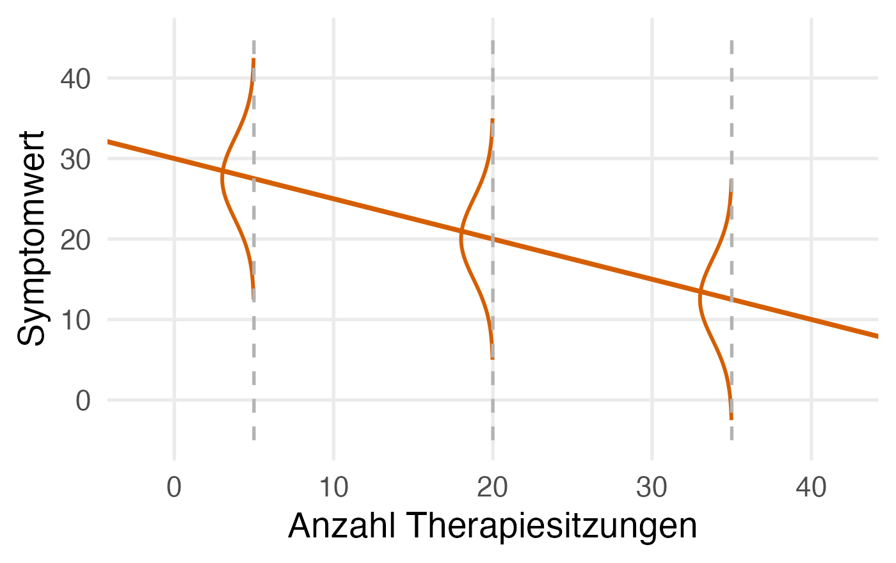{fig-alt="Regressionsgerade für einen Symptomwert mit Normalverteilungen um den Mittelwert bei 5, 20 und 35 Sitzungen." width="58%"}
::::
:::: {.column width="50%"}
::: {.fragment fragment-index=1}
[Binäre abhängige Variable: Remission]{.logit}

$$Y_i \sim \mathcal{B}(1,\ \pi_i), \quad \pi_i = \ ?$$

[Binomialverteilung ($\mathcal{B}$) mit einem Versuch: $Y_i$ ist 1 (Remission) mit der Wahrscheinlichkeit $\pi_i$, sonst 0.]{.lesehilfe}
:::

::: {.r-stack}
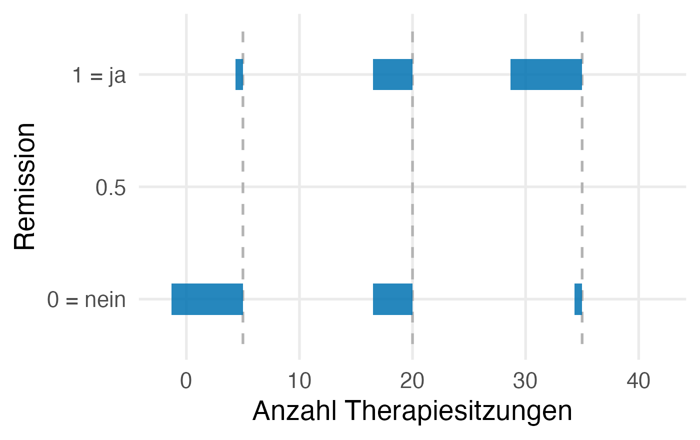{.fragment fragment-index=2 fig-alt="Balken für die Wahrscheinlichkeit von 0 und 1 bei 5, 20 und 35 Sitzungen; mit mehr Sitzungen wächst der Balken bei 1." width="58%"}

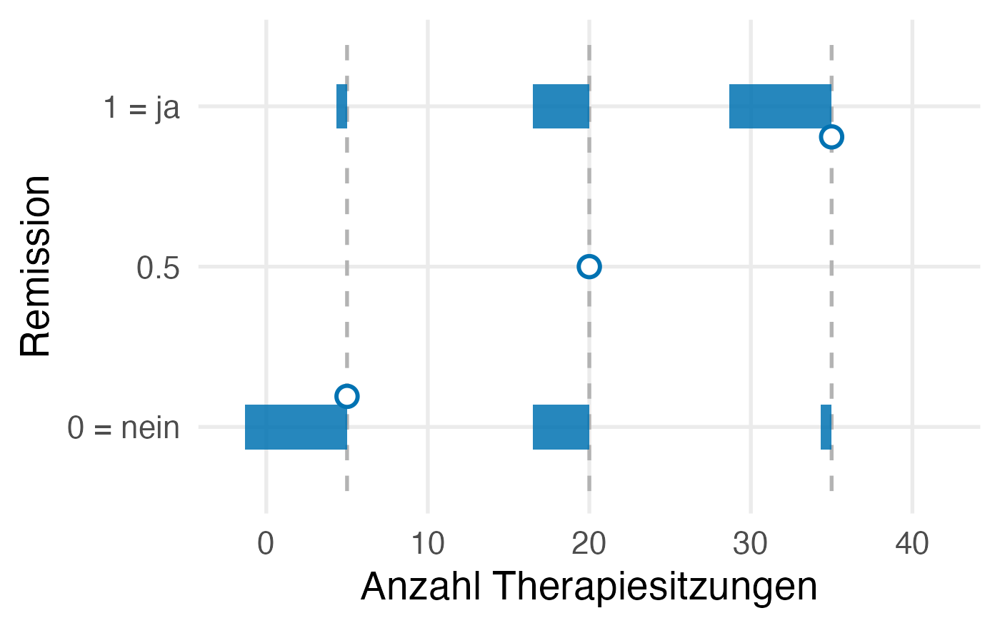{.fragment fragment-index=3 fig-alt="Dieselben Balken; zusätzlich markiert bei 5, 20 und 35 Sitzungen je ein Kreis pi, die Wahrscheinlichkeit für 1. Mit mehr Sitzungen liegt der Kreis höher." width="58%"}
:::
::::
:::::

::: {.fragment .merke fragment-index=4}
Gleiche Struktur: eine **Verteilung** und ein **Parameter, der von $x$ abhängt**.
:::

::: {.notes}
IDEE 1 (2:35–4:20), 4 Klicks. Start: nur links. (v3: −15 s; ℬ(n, π) nur als «aus Statistik I» nennen, das Rate-Beispiel mit 20 Fragen weglassen.)
Links: Was sie kennen. Jede Person hat ihre eigene Normalverteilung; der Mittelwert
mu_i liegt auf der Geraden.
[Klick] Rechts Formel: Binäre AV braucht eine andere Verteilung. «Erinnern Sie sich an die
Binomialverteilung aus Statistik I: X ~ B(n, pi), Anzahl richtige Antworten, wenn man
bei 20 Single-Choice-Fragen rät. Hier ziehen wir pro Person genau einmal: n = 1.»
(B(1, pi) heisst auch Bernoulli-Verteilung.)
[Klick] Balken: bei 5 Sitzungen meist 0, bei 35 meist 1.
[Klick] Kreise: Die Kreise sind pi_i, der Mittelwert der 0/1-Variable.
Frage an den Raum: «Was liegt nahe für pi_i?» → «Die Gerade wie links!»
[Klick] Merke-Box: gleiche Struktur.
Genau das hat die lineare Regression gemacht, und das ging schief. Warum?
Falls jemand nach sigma^2 fragt: Bei B(1, pi) ist die Varianz pi(1 − pi). Sie hängt
an pi, deshalb braucht es keinen eigenen Streuungsparameter.
:::

## Das Problem: der Wertebereich

$\pi_i$ liegt zwischen 0 und 1, aber $\beta_0 + \beta_1 x_i$ kann jeden Wert annehmen.

```{=html}
<table class="leiter">
  <tr class="fragment"><td><b>Wahrscheinlichkeit</b></td><td>\(\pi\)</td><td class="range">0 bis 1</td><td></td></tr>
  <tr class="fragment"><td><b>Odds</b></td><td>\(\dfrac{\pi}{1-\pi}\)</td><td class="range">0 bis ∞</td><td>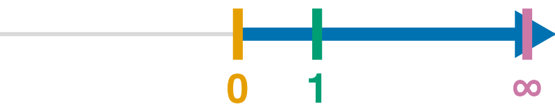</td></tr>
  <tr class="fragment"><td><b>Log-Odds</b></td><td>\(\ln\!\left(\dfrac{\pi}{1-\pi}\right)\)</td><td class="range">−∞ bis ∞</td><td>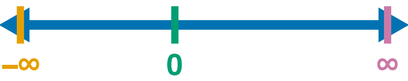</td></tr>
</table>
```

[$\pi$: Wahrscheinlichkeit einer Remission · Odds: Wahrscheinlichkeit dafür geteilt durch dagegen · $\ln$: natürlicher Logarithmus · $\infty$: unendlich · Farbe: dasselbe $\pi$]{.lesehilfe}

::: {.fragment .denkpause}
**Denkpause:** Wenn $\pi = .8$, wie gross sind die Odds?
:::

::: {.fragment}
$.8 / .2 = `r odds_80`$: Auf `r odds_80` Remissionen kommt eine Nicht-Remission. Kennen Sie aus dem Bayes-Beispiel in Statistik I (Prior-Odds).
:::

::: {.notes}
IDEE 2 (4:20–6:10), 5 Klicks (die Zahlenstrahlen kommen mit ihrer Zeile). v3: −10 s; die Frage «kleinster, grösster Wert?» nur bei Odds und Log-Odds (der Bereich von π ist die Prämisse), Denkpause 15 s.
[Klick] Wahrscheinlichkeit, [Klick] Odds, [Klick] Log-Odds; jeweils «Was ist der
kleinste, was der grösste Wert?» Auf den Zahlenstrahl zeigen: der Bereich wächst.
Farben mitverfolgen: «Orange ist π = 0: Odds 0, Log-Odds minus unendlich. Grün ist
π = .5: Odds 1, Log-Odds 0. Lila ist π = 1: unendlich.» (π = .8 bewusst nicht
markiert, das ist die Denkpause.)
[Klick] DENKPAUSE, 15 Sekunden, Antwort aus dem Raum holen (4). [Klick] Auflösung.
Symmetrie mündlich: «.2 und .8 liegen symmetrisch um 0.»
Anknüpfen an Statistik I: odds_prior <- 0.8/0.2, und zurück mit odds/(1 + odds).
Log-Odds: ln von Werten zwischen 0 und 1 ist negativ, ln(1) = 0, ln von Werten > 1
positiv. Damit ist der ganze Zahlenstrahl abgedeckt.
:::

## Das logistische Regressionsmodell

:::: {.columns}
::: {.column .modell-links width="48%"}
$$Y_i \sim \mathcal{B}(1,\ \pi_i)$$

::: {.r-stack}
::: {.fragment .fade-out fragment-index=1}
$$\pi_i = \ ?$$
:::
::: {.fragment fragment-index=1}
$$\ln\!\left(\frac{\pi_i}{1-\pi_i}\right) = \beta_0 + \beta_1 x_i$$
:::
:::

::: {.fragment fragment-index=2}
Zurück zur Wahrscheinlichkeit, wie im Bayes-Beispiel:

::: {.fragment .highlight-current-blue fragment-index=2}
$$\text{Odds}_i = e^{\text{Log-Odds}_i} = e^{\beta_0 + \beta_1 x_i}$$

[$e \approx 2.718$ (Eulersche Zahl); «$e$ hoch …» macht den Logarithmus $\ln$ rückgängig.]{.lesehilfe}
:::
:::

::: {.fragment fragment-index=3}
::: {.fragment .highlight-current-blue fragment-index=3}
$$
\pi_i = \frac{\text{Odds}_i}{1 + \text{Odds}_i}
= \frac{e^{\beta_0 + \beta_1 x_i}}{1 + e^{\beta_0 + \beta_1 x_i}}
$$
:::
:::
:::
::: {.column width="52%"}
::: {.fragment fragment-index=4}
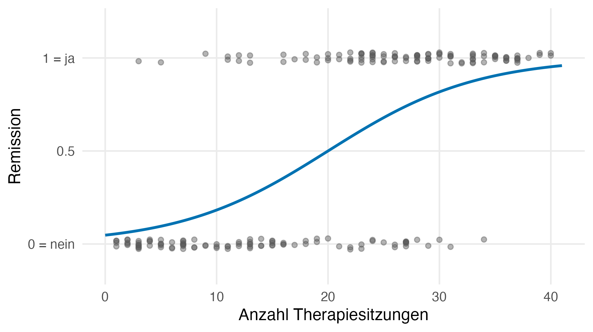{fig-alt="Dieselben Daten mit einer S-förmigen Kurve, die von nahe 0 bei wenigen Sitzungen auf nahe 1 bei vielen Sitzungen ansteigt und den Bereich 0 bis 1 nie verlässt."}

[Kurve mit Achsenabschnitt $\beta_0 = `r beta0`$ und Steigung $\beta_1 = `r beta1`$]{.small-note}
:::
:::
::::

::: {.notes}
(6:10–7:10), 4 Klicks. Start: «pi_i = ?» wie auf Folie 6.
[Klick] Logit-Gleichung ersetzt das Fragezeichen. Der lineare Teil bleibt: links steht
jetzt logit(pi_i) statt mu_i.
[Klick] Zurückrechnen, erster Schritt (blau): e hoch Log-Odds gibt die Odds.
[Klick] Zweiter Schritt (blau): Odds/(1 + Odds) gibt die Wahrscheinlichkeit.
Dieselbe Formel wie im Bayes-Beispiel.
[Klick] Ergebnis: Die S-Kurve. Sie bleibt zwischen 0 und 1, egal wie viele Sitzungen.
:::

## Schneller wirkende Therapie: $\beta_1$ verdoppelt sich {.nostretch}

```{r slider-data}
#| results: asis
d <- read.csv("data/remission.csv")
cat("<script>window.remissionData = ",
    jsonlite::toJSON(d[, c("sitzungen", "remission")]),
    "; window.logitStart = ",
    jsonlite::toJSON(list(b0 = beta0, b1 = beta1), auto_unbox = TRUE),
    ";</script>", sep = "")
```

```{=html}
<div class="logit-widget">
  <div class="slider-controls">
    <label>Achsenabschnitt β₀ = <b id="b0-val"></b>
      <input type="range" id="b0" min="-8" max="4" step="0.1"></label>
    <label>Steigung β₁ = <b id="b1-val"></b>
      <input type="range" id="b1" min="-0.3" max="0.6" step="0.01"></label>
    <label><input type="checkbox" id="show-ref" checked> Ausgangskurve</label>
    <div class="slider-buttons">
      <button id="animate" type="button">Animieren</button>
      <button id="reset" type="button">Zurücksetzen</button>
    </div>
  </div>
  <svg id="logit-svg" viewBox="0 0 900 400" role="img"
       aria-label="Interaktive S-Kurve der logistischen Regression"></svg>
</div>
<script>
(function () {
  const data = window.remissionData, start = window.logitStart;
  const svg = document.getElementById("logit-svg");
  const W = 900, H = 400, m = {l: 90, r: 20, t: 15, b: 55};
  const xMin = 0, xMax = 41, yMin = -0.15, yMax = 1.2;
  const sx = x => m.l + (x - xMin) / (xMax - xMin) * (W - m.l - m.r);
  const sy = y => H - m.b - (y - yMin) / (yMax - yMin) * (H - m.t - m.b);
  const ns = "http://www.w3.org/2000/svg";
  const el = (tag, attrs, parent) => {
    const e = document.createElementNS(ns, tag);
    for (const k in attrs) e.setAttribute(k, attrs[k]);
    (parent || svg).appendChild(e);
    return e;
  };
  // Achsen und Gitter
  [0, 0.5, 1].forEach(v => {
    el("line", {x1: sx(xMin), x2: sx(xMax), y1: sy(v), y2: sy(v),
                stroke: "#e3e3e3", "stroke-width": 1.5});
    const t = el("text", {x: m.l - 10, y: sy(v) + 6, "text-anchor": "end",
                          "font-size": 20, fill: "#555"});
    t.textContent = v === 0 ? "0 = nein" : v === 1 ? "1 = ja" : "0.5";
  });
  [0, 10, 20, 30, 40].forEach(v => {
    el("line", {x1: sx(v), x2: sx(v), y1: sy(yMin), y2: sy(yMax),
                stroke: "#f0f0f0", "stroke-width": 1.5});
    const t = el("text", {x: sx(v), y: H - m.b + 26, "text-anchor": "middle",
                          "font-size": 20, fill: "#555"});
    t.textContent = v;
  });
  const xl = el("text", {x: (m.l + W - m.r) / 2, y: H - 6,
                         "text-anchor": "middle", "font-size": 22});
  xl.textContent = "Anzahl Therapiesitzungen";
  // Datenpunkte (deterministisches Jittern)
  data.forEach((d, i) => {
    const jit = ((i * 37) % 13 - 6) / 6 * 0.03;
    el("circle", {cx: sx(d.sitzungen), cy: sy(d.remission + jit), r: 4.5,
                  fill: "#595959", "fill-opacity": 0.45});
  });
  const refPath = el("path", {fill: "none", stroke: "#0072B2",
    "stroke-width": 3, "stroke-dasharray": "8 6", "stroke-opacity": 0.5});
  const curPath = el("path", {fill: "none", stroke: "#009E73",
                              "stroke-width": 4.5});
  const midLine = el("line", {stroke: "#009E73", "stroke-width": 2,
                              "stroke-dasharray": "4 4"});
  // Beschriftung unter der 0.5-Linie, mit weissem Rand gegen Kurven und Punkte
  const midText = el("text", {"font-size": 20, fill: "#009E73",
                              stroke: "#fff", "stroke-width": 5,
                              "paint-order": "stroke", "text-anchor": "start"});
  const pathFor = (b0, b1) => {
    let p = "";
    for (let k = 0; k <= 200; k++) {
      const x = xMin + k / 200 * (xMax - xMin);
      const y = 1 / (1 + Math.exp(-(b0 + b1 * x)));
      p += (k ? "L" : "M") + sx(x).toFixed(1) + "," + sy(y).toFixed(1);
    }
    return p;
  };
  refPath.setAttribute("d", pathFor(start.b0, start.b1));
  const b0In = document.getElementById("b0"), b1In = document.getElementById("b1");
  const showRef = document.getElementById("show-ref");
  const fmt = (v, d) => Number(v).toFixed(d).replace("-", "−");
  function update() {
    const b0 = +b0In.value, b1 = +b1In.value;
    document.getElementById("b0-val").textContent = fmt(b0, 1);
    document.getElementById("b1-val").textContent = fmt(b1, 2);
    curPath.setAttribute("d", pathFor(b0, b1));
    refPath.style.display = showRef.checked ? "" : "none";
    const xm = b1 !== 0 ? -b0 / b1 : NaN;
    if (isFinite(xm) && xm >= xMin && xm <= xMax) {
      midLine.setAttribute("x1", sx(xm)); midLine.setAttribute("x2", sx(xm));
      midLine.setAttribute("y1", sy(0.5)); midLine.setAttribute("y2", sy(yMin));
      // Steigende Kurve: rechts unterhalb von .5 ist frei; fallende Kurve: links.
      // Am Rand auf die andere Seite wechseln, damit der Text im Bild bleibt.
      let right = b1 > 0;
      if (right && sx(xm) > W - m.r - 270) right = false;
      if (!right && sx(xm) < m.l + 270) right = true;
      midText.setAttribute("text-anchor", right ? "start" : "end");
      midText.setAttribute("x", sx(xm) + (right ? 10 : -10));
      midText.setAttribute("y", sy(0.5) + 26);
      midText.textContent = "π = .5 bei " + fmt(xm, 1) + " Sitzungen";
      midLine.style.display = midText.style.display = "";
    } else {
      midLine.style.display = midText.style.display = "none";
    }
  }
  // Animieren: beta1 in 1.5 s von der Ausgangskurve auf das Doppelte
  let tween = null;
  function stopTween() { if (tween !== null) cancelAnimationFrame(tween); tween = null; }
  function animate() {
    stopTween();
    const from = start.b1, to = 2 * start.b1, dur = 1500;
    b0In.value = start.b0; b1In.value = from; update();
    const t0 = performance.now();
    const step = now => {
      const u = Math.min(1, (now - t0) / dur);
      const e = u < 0.5 ? 2 * u * u : 1 - Math.pow(-2 * u + 2, 2) / 2;
      b1In.value = from + (to - from) * e;
      update();
      tween = u < 1 ? requestAnimationFrame(step) : null;
    };
    tween = requestAnimationFrame(step);
  }
  function reset() { stopTween(); b0In.value = start.b0; b1In.value = start.b1; update(); }
  [b0In, b1In, showRef].forEach(e => e.addEventListener("input", update));
  [b0In, b1In].forEach(e => e.addEventListener("input", stopTween));
  document.getElementById("reset").addEventListener("click", reset);
  // Nach dem Klick den Fokus abgeben, damit Leertaste/Pfeile wieder die Folien steuern
  document.getElementById("animate").addEventListener("click", ev => {
    animate(); ev.currentTarget.blur();
  });
  // Pfeiltasten im Slider nicht an reveal.js weitergeben
  [b0In, b1In].forEach(e => e.addEventListener("keydown", ev => ev.stopPropagation()));
  reset();
})();
</script>
```

::: {.notes}
DENKPAUSE + SLIDER (7:10–7:55), kein Folienklick.
Vorher, noch auf Folie 8: [Cockpit] Blick aufs Handy (Live Feedback): «Kurzer
Blick auf Ihre Regler: Tempo … , Schwierigkeit … .» Bei «zu schnell»: Denkpause hier
20 s statt 15 s. Bei weniger als ~5 Eingaben: nichts sagen.
Erst fragen, dann schieben: «β1 von 0.15 auf 0.30. Wird die Kurve steiler, flacher,
oder verschiebt sie sich? Und ab wie vielen Sitzungen ist Remission so wahrscheinlich
wie keine? Kurz mit Ihrem Nebenan besprechen.» (15 s)
Dann «Animieren» klicken (Maus, kein Folienklick): β1 läuft in 1.5 s von 0.15 auf
0.30. Auflösung: steiler UND der Punkt mit π = .5 wandert von
x = `r x_mid` nach x = `r x_mid2` (weil π = .5 bei x = −β0/β1). Klinisch: «Mit der
schneller wirkenden Therapie ist Remission schon nach `r x_mid2` statt nach `r x_mid`
Sitzungen so wahrscheinlich wie keine.»
Falls jemand fragt, ob mehr Sitzungen die Remission verursachen: «Das sagen diese
Daten nicht. Es sind Beobachtungsdaten; wer schwerer belastet ist, bekommt oft mehr
Sitzungen. Dazu gibt es eine Übung auf der Materialseite.»
Kein negatives β1 mehr (v3: die 15 s gehen in den Selbsttest). Falls jemand fragt:
«Kurve fällt», einmal kurz schieben.
Fallback (kein Browser/JS): Backup-Folie am Ende (fig5).
Entscheidung am Ende dieser Folie (Stoppuhr): bis 8:10 → Selbsttest voll; 8:10–8:35 →
Selbsttest kurz (Block nach 25 s von Hand schliessen, zwei Sätze); nach 8:35 → kein
Selbsttest: G 11 Enter, Mitnehmen selbst sagen.
:::

## Haben Sie es? Vier Aussagen, richtig oder falsch {.selbsttest}

:::: {.columns}
::: {.column width="72%"}
::: {.klicker}
**KlickerUZH (K-Prim):** Welche der folgenden Aussagen über die logistische Regression treffen zu? Wählen Sie für jede Aussage aus, ob sie richtig oder falsch ist.

A. $\mathcal{B}(1, \pi_i)$ gibt jeder Person ein eigenes $\pi_i$, so wie $\mathcal{N}(\mu_i, \sigma^2)$ jeder Person ein eigenes $\mu_i$ gibt.

B. In der logistischen Regression ist $\pi_i$ eine lineare Funktion der Anzahl Sitzungen $x_i$.

C. Wenn $\pi = `r fmt_pi(pi_check)`$, betragen die Odds $`r odds_check`$.

D. Log-Odds liegen wie Wahrscheinlichkeiten zwischen 0 und 1.
:::
:::
::: {.column width="28%"}
```{r join-slide10}
#| results: asis
join_box(130, "40 Sekunden")
```
:::
::::

::: {.notes}
SELBSTTEST (7:55–9:20), keine Klicks. Block 2 in KlickerUZH (KPRIM, Countdown 40 s).
Die vier Sätze stehen hier wie in KlickerUZH, damit auch mitliest, wer nicht drin ist.
[Klicker] Block 2 öffnen, dabei: «Zum Schluss prüfen Sie selbst: vier Aussagen,
richtig oder falsch, 40 Sekunden.» Nicht kommentieren, warten.
Block schliesst sich nach 40 s selbst (früher von Hand, wenn die Balken stehen).
[Fenster] Ctrl+Tab zum KlickerUZH-Auswertungstab (Balkendiagramm, Lösung einblenden).
Pro Aussage ein Satz, in dieser Reihenfolge (= Merke-Punkte):
A richtig: «Gleiche Struktur, andere Verteilung: ein Parameter pro Person, der von x abhängt.»
B falsch: «Linear sind die Log-Odds. π folgt der S-Kurve und bleibt zwischen 0 und 1.»
C richtig: «`r fmt_pi(pi_check)` durch `r fmt_pi(1 - pi_check)` ist `r odds_check`: drei Remissionen auf eine Nicht-Remission.»
D falsch: «Log-Odds laufen von minus bis plus unendlich; unter π = .5 sind sie negativ.
Genau deshalb darf hier eine Gerade stehen.»
Bei einem Balken mit vielen Fehlern: diesen Satz zuerst, und er ist der erste Satz der Diskussion.
[Fenster] Ctrl+Tab zurück zu den Folien, weiter zu Mitnehmen.
Fallback ohne Netz: Handzeichen je Aussage («Wer sagt richtig?»), gleiche vier Sätze.
Fallback < 8 Teilnehmende: Block trotzdem öffnen, aber statt Balken zwei Personen fragen.
:::

## Mitnehmen

::: {.merke}
1. Jedes statistische Modell ist eine **Verteilungsannahme**: Normalverteilung für stetige, Binomialverteilung $\mathcal{B}(1, \pi_i)$ für binäre abhängige Variablen.
2. Weil die Wahrscheinlichkeit $\pi_i$ zwischen 0 und 1 liegt, modellieren wir ihre **Log-Odds** als lineare Funktion von $x$ (Anzahl Sitzungen). So sagt das Modell nie eine unmögliche Remissionswahrscheinlichkeit vorher.
:::

::: {.fragment fragment-index=1}
**Als Nächstes:** Was bedeutet die Steigung $\beta_1$? Odds Ratios · Schätzung · in R:

```r
glm(remission ~ sitzungen, family = binomial, data = remission_data)
```
:::

:::: {.columns}
::: {.column width="70%"}
**Material, Daten und R-Code:**<br>
[`r materials_url`](`r materials_url`)
:::
::: {.column width="30%"}
```{r qr}
#| fig-width: 2
#| fig-height: 2
#| fig-alt: "QR-Code zur Materialseite"
if (requireNamespace("qrcode", quietly = TRUE)) {
  plot(qrcode::qr_code(materials_url))
}
```
:::
::::

::: {.notes}
ABSCHLUSS (9:20–9:30), 1 Klick. Beide Merke-Punkte stehen sofort (v3: der Selbsttest
hat sie gerade aufgelöst). Nur zeigen: «Das sind die zwei Sätze zum Mitnehmen.»
[Klick] Ausblick: «Als Nächstes: was β1 = 0.15 heisst, Odds Ratios, dann glm() in R.
Material und Daten unter dem Link.»
Ohne Selbsttest (Notbremse, G 11 Enter): die zwei Sätze selbst sagen (30 s):
«Wir behalten die Struktur des Modells, tauschen die Verteilung aus und transformieren
den Parameter so, dass der lineare Teil passt.» Dann derselbe eine Klick: Ausblick.
:::

## Backup: schneller wirkende Therapie, β₁ verdoppelt {visibility="uncounted"}

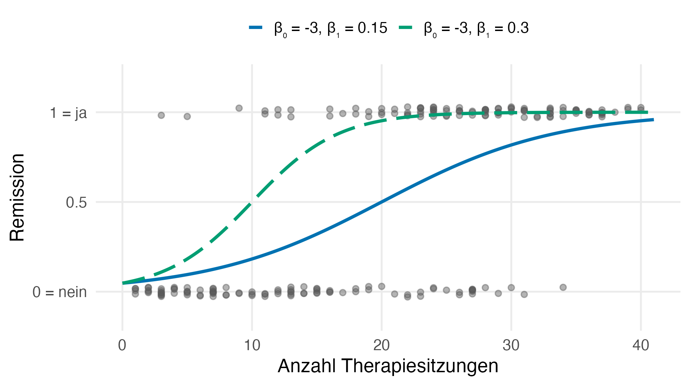{fig-alt="Zwei S-Kurven: durchgezogen mit Beta1 gleich 0.15, gestrichelt mit Beta1 gleich 0.30. Die gestrichelte Kurve ist steiler und erreicht 0.5 schon bei 10 statt bei 20 Sitzungen." width="78%"}

Remission so wahrscheinlich wie keine ($\pi = .5$): mit $\beta_1 = `r beta1`$ nach `r x_mid` Sitzungen,<br>mit doppelter Steigung ($\beta_1 = `r 2 * beta1`$) schon nach `r x_mid2`. Allgemein: nach $-\beta_0/\beta_1$ Sitzungen.
